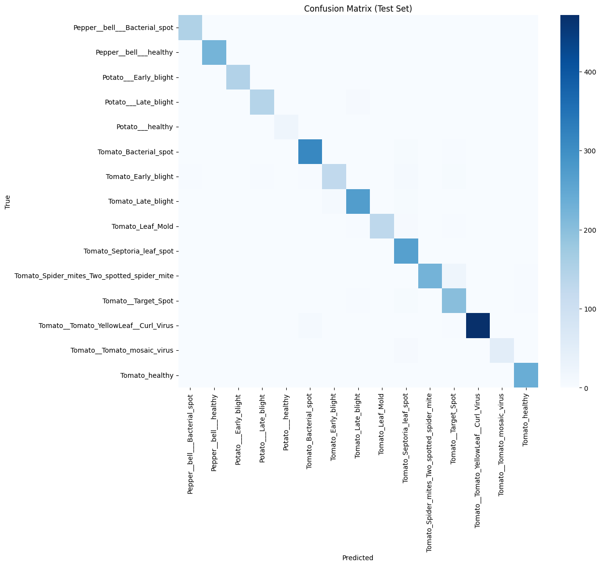
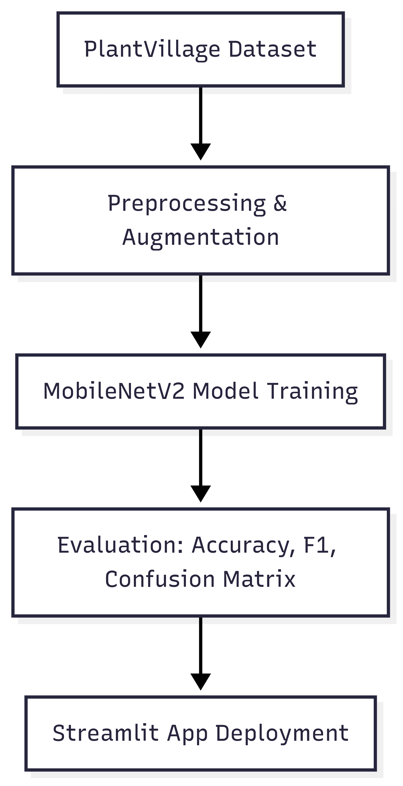
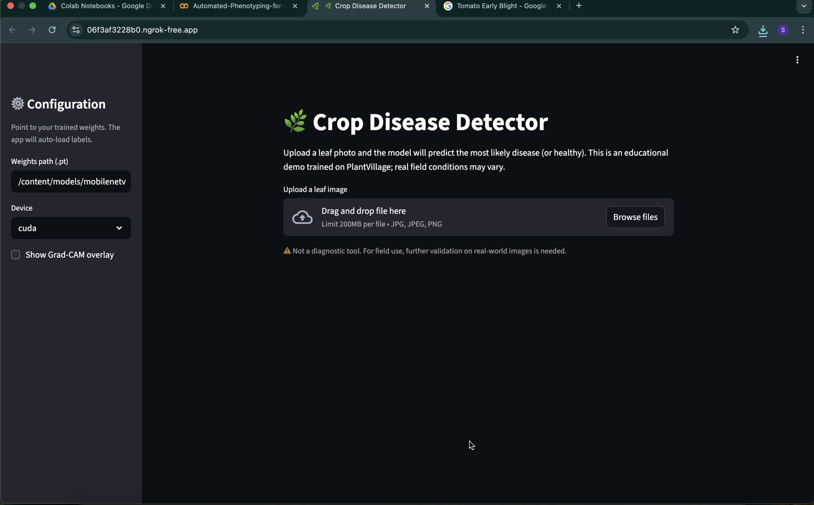

# Automated-Phenotyping-for-Plant-Stress

## Overview
This project applies deep learning (MobileNetV2) to automatically detect and classify plant diseases in Potato, Pepper Bell, and Tomato crops. Using the PlantVillage dataset (15 classes), the model achieves state-of-the-art accuracy while being lightweight enough for real-time applications.
Impact: Early and accurate disease detection can help farmers reduce losses, optimize treatment, and improve food security.

## Key Features
	•	Dataset: PlantVillage (Kaggle), with 15 disease/healthy classes.
	•	Model: MobileNetV2 — efficient, mobile-friendly CNN architecture.
	•	Performance:
	•	Test Accuracy: 95.8%
	•	Macro F1-score: 0.96
	•	Confusion Matrix: Demonstrates strong classification performance across classes.
	•	Streamlit App: Built an interactive demo for real-time disease classification.

## Results
Classification Report (excerpt)

### Classification Report (Selected Classes)

| Class                               | Precision | Recall | F1-score | Support |
|-------------------------------------|-----------|--------|----------|---------|
| Pepper__bell___Bacterial_spot       | 0.97      | 0.99   | 0.98     | 151     |
| Potato___Early_blight               | 0.99      | 0.99   | 0.99     | 150     |
| Tomato_Bacterial_spot               | 0.96      | 0.97   | 0.97     | 320     |
| Tomato_Septoria_leaf_spot           | 0.88      | 1.00   | 0.93     | 267     |
| Tomato__Tomato_YellowLeaf__Curl_Virus | 0.99    | 0.98   | 0.98     | 482     |
| Tomato_healthy                      | 0.98      | 1.00   | 0.99     | 240     |

**Overall Accuracy:** 95.82% (3109 test samples)  
**Macro Avg F1:** 0.96

### Confusion Matrix

## Workflow
### flowchart 

## Streamlit Demo
The project includes a Streamlit web app that allows users to upload leaf images and instantly receive disease predictions.

### Features:
	•	Upload crop leaf images (Potato, Pepper Bell, Tomato)
	•	Real-time prediction with probability scores per class
	•	Visualization of model confidence

### Demo Preview.

## Project Structure

├── Automated_Phenotyping_for_Plant_Stress.ipynb  
├── streamlit/app.py                             
├── models/                                       
├── assets/                                                             
└── README.md

## Recruiter’s Note

This project demonstrates:
	•	Proficiency in deep learning (CNNs, MobileNetV2)
	•	End-to-end ML pipeline: preprocessing → training → evaluation → deployment
	•	Strong focus on real-world application (agriculture & food security)
	•	Ability to build production-ready ML apps (Streamlit)

## Next Steps
	•	Expand dataset with multi-crop coverage (maize, wheat, rice).
	•	Deploy as a mobile app for on-field usage.

